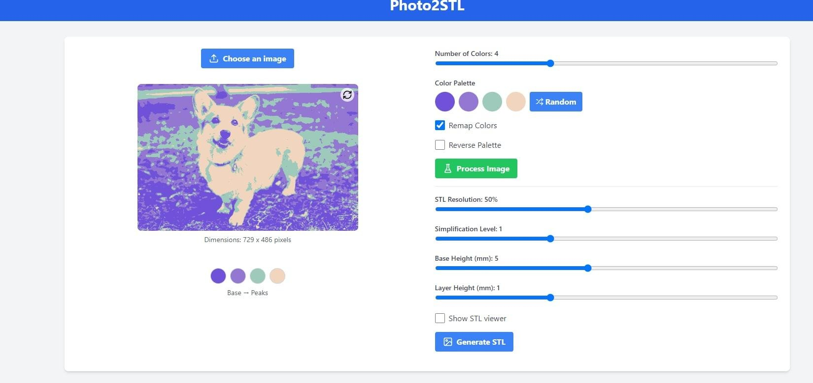
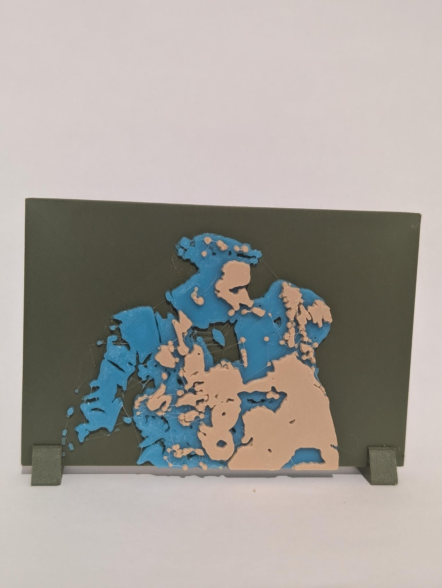

# Img2Stl

This was a project created by my brother - for creating an stl file from a colored image using k-means clustering, height mapping and some creative filament color changes

This repo is a fork of it where I ported all the functionality into a purely client side app which _mostly_ works (I have found a few edge cases that it didn't seem to handle super well)

I didn't worry about completely finishing it / cleaning up it, but the app is live and mostly works

[https://img2stl.lbat.ch/](https://img2stl.lbat.ch/)

### Screenshot

### Example of an early print
